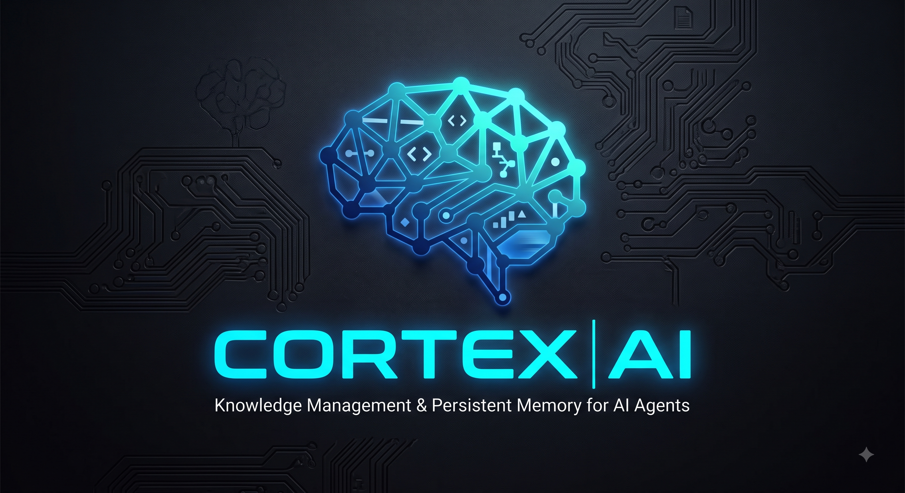

# CORTEX-AI — Second Brain for Coding Agents

<p align="center">
  
</p>

**CORTEX-AI** is a knowledge management system that gives coding agents (Claude Code, OpenCode, Gemini CLI, Codex, etc.) persistent memory and project intelligence across sessions. It acts as a **second brain**: every project decision, specification, architecture document, and design asset lives in Google Drive and is indexed by Google NotebookLM for semantic retrieval.

## What It Does

- **Persistent project memory** — specs, decisions, designs survive across sessions and agents.
- **Semantic search** — query project knowledge in natural language via NotebookLM.
- **Cross-project search** — find where you solved something before, across all your projects.
- **Onboarding summaries** — resume work after days/weeks with an AI-generated executive summary.
- **System health dashboard** — see which projects are synced, pending indexing, or need attention.
- **Multi-agent support** — works with OpenCode, Claude Code, Gemini CLI, and any agent that supports MCP servers.
- **Git integration** — syncs commits, PRs, and issues to the second brain for full project context.
- **Auto-sync** — Git hooks automatically queue documentation changes for sync on commit/push.
- **Team organization** — group projects into team namespaces for organized management.
- **Scalable search** — paginated cross-project search with team filtering for large deployments.
- **Cleanup & archival** — archive inactive projects and clean stale notebook sources.

## Architecture

```
┌─────────────────────────────────────────────────────┐
│                  CODING AGENT                        │
│  (OpenCode / Claude Code / Gemini / Codex / etc.)   │
│                                                      │
│  ┌──────────┐  ┌──────────┐  ┌──────────┐          │
│  │  Skills  │  │   MCP    │  │   MCP    │          │
│  │ (9)      │  │notebooklm│  │google-dri│          │
│  └──────────┘  └────┬─────┘  └────┬─────┘          │
│                      │             │                 │
│  ┌──────────┐  ┌─────┴─────┐      │                 │
│  │   MCP    │  │   MCP    │      │                 │
│  │  engram  │  │  github   │      │                 │
│  └────┬─────┘  └─────┬─────┘      │                 │
└───────┼──────────────┼─────────────┼────────────────┘
        │              │             │
        ▼              ▼             ▼
┌───────────┐  ┌─────────────┐  ┌──────────────┐
│  ENGRAM   │  │ NOTEBOOKLM  │  │ GOOGLE DRIVE │
│ Cross-ref │  │  Google AI  │  │  File Store  │
│ Persist.  │  │  Semantic   │  │  (source of  │
│  Memory   │  │   Search    │  │   truth)     │
└───────────┘  └─────────────┘  └──────────────┘
        │
        ▼
┌───────────────┐
│    GITHUB     │
│  Commits, PRs │
│  Issues, etc. │
└───────────────┘
```

### Components

| Component | Technology | Role |
|-----------|-----------|------|
| **Skills** (14) | Markdown instruction files | Expert workflows that teach agents how to use the second brain |
| **Google Drive** | MCP `@piotr-agier/google-drive-mcp` | Stores project docs, specs, READMEs — the source of truth |
| **Google NotebookLM** | MCP `notebooklm-mcp-cli` | Indexes Drive documents, provides semantic search and summaries |
| **Engram** | CLI `engram` | Persistent cross-reference memory — maps project IDs → Drive folder IDs → Notebook IDs |
| **GitHub** | MCP `@modelcontextprotocol/server-github` | Reads commits, PRs, and issues for Git context sync |

## The Fourteen Skills

| Skill | Trigger | What It Does |
|-------|---------|--------------|
| `cortex-ai-init` | "init cortex", "inicializar cerebro" | Register a project: creates Drive folder, README, NotebookLM notebook, cross-reference + optional Git sync + optional auto-sync + team support |
| `cortex-ai-push` | "push cortex", "sync docs" | Sync changed local docs → Drive → NotebookLM + optional Git context refresh (supports team-scoped projects) |
| `cortex-ai-ask` | "ask cortex", "pregunta sobre" | Query project knowledge via NotebookLM first, local docs as fallback |
| `cortex-ai-onboard` | "resume del proyecto", "ponme al dia" | Generate executive summary from notebook + Git activity to resume after inactivity |
| `cortex-ai-status` | "status del cerebro", "how is the brain" | System-wide health report across ALL registered projects (including Git sync + auto-sync status) |
| `cortex-ai-cross-search` | "buscar en todos", "cross search" | Search the same query across project notebooks with pagination and team filtering |
| `cortex-ai-reindex` | "reindexa", "rebuild notebook" | Destructive rebuild of a notebook from Drive folder contents |
| `cortex-ai-git-sync` | "sync git", "git context", "sincronizar git" | Sync Git repository metadata (commits, PRs, issues) to Drive and NotebookLM |
| `cortex-ai-git-context` | "git context", "quién trabajó", "hay PRs" | Query a project's Git activity from the synced git-context document |
| `cortex-ai-autosync-setup` | "setup autosync", "install hooks", "configurar sync automatico" | Install Git hooks for automatic documentation synchronization |
| `cortex-ai-autosync-check` | "check autosync", "pending sync", "procesar sync" | Check for pending auto-sync markers and execute queued synchronization |
| `cortex-ai-team` | "create team", "crear equipo", "list teams" | Create and manage team namespaces for organizing projects |
| `cortex-ai-status-team` | "team status", "status equipo", "team health" | Health report scoped to a specific team or cross-team comparison |
| `cortex-ai-cleanup` | "cleanup", "archivar", "archive project", "limpiar" | Archive inactive projects, clean stale sources, generate storage reports |

## Project Structure

```
cortex-ai/
├── README.md                    # This file (English)
├── README-es.md                 # Spanish version
├── INSTALL.md                   # Installation guide (English)
├── INSTALL-es.md                # Installation guide (Spanish)
├── skills/                      # CORTEX-AI skill definitions
│   ├── cortex-ai-ask/SKILL.md
│   ├── cortex-ai-cross-search/SKILL.md
│   ├── cortex-ai-git-context/SKILL.md
│   ├── cortex-ai-git-sync/
│   │   ├── SKILL.md
│   │   └── assets/git-context-template.md
│   ├── cortex-ai-autosync-setup/
│   │   ├── SKILL.md
│   │   └── assets/
│   │       ├── post-commit.sh
│   │       └── post-push.sh
│   ├── cortex-ai-autosync-check/SKILL.md
│   ├── cortex-ai-team/
│   │   ├── SKILL.md
│   │   └── assets/team-readme-template.md
│   ├── cortex-ai-status-team/SKILL.md
│   ├── cortex-ai-cleanup/SKILL.md
│   ├── cortex-ai-init/
│   │   ├── SKILL.md
│   │   └── assets/readme-template.md
│   ├── cortex-ai-onboard/SKILL.md
│   ├── cortex-ai-push/SKILL.md
│   ├── cortex-ai-reindex/SKILL.md
│   └── cortex-ai-status/SKILL.md
├── mcp/                         # MCP server config snippets
│   ├── notebooklm.json
│   ├── google-drive.json
│   ├── engram.json
│   └── github.json
├── configs/                     # Per-agent ready-to-use configs
│   ├── opencode.json
│   ├── claude-code.json
│   ├── gemini.json
│   └── codex.json
└── .atl/                        # Auto-generated meta-artifacts
    └── skill-registry.md
```

## Prerequisites

- **Google Account** — for Google Drive and NotebookLM access.
- **notebooklm-mcp** — MCP server for NotebookLM (`uv tool install notebooklm-mcp-cli`).
- **google-drive-mcp** — MCP server for Google Drive (`npx @piotr-agier/google-drive-mcp`).
- **engram** — optional but recommended, for cross-reference persistence.
- **Node.js** — required by the google-drive MCP (`npx`).
- **GitHub Personal Access Token** — optional, for Git context sync (`GITHUB_TOKEN` env var).

## Quick Start

See **[INSTALL.md](./INSTALL.md)** (English) or **[INSTALL-es.md](./INSTALL-es.md)** (Español) for detailed per-agent installation steps.

1. Install the three MCP servers.
2. Configure your coding agent's MCP section (use files in `configs/` as templates).
3. Copy the skills to your agent's skills directory.
4. Run `cortex-ai-init` on your first project.

## License

Apache-2.0
